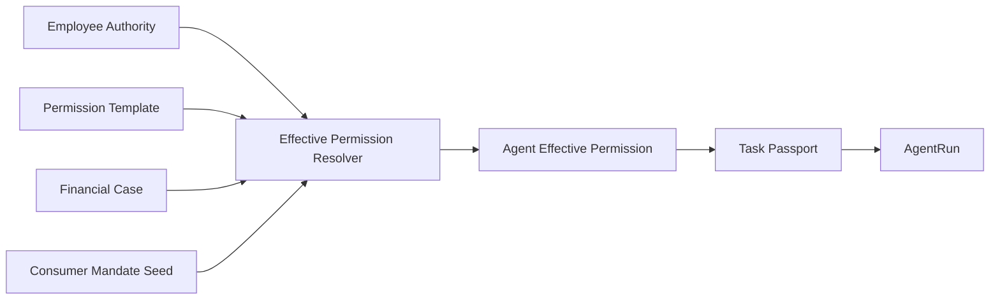
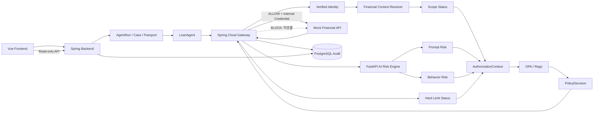
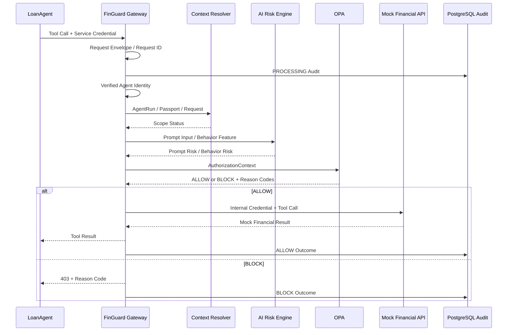
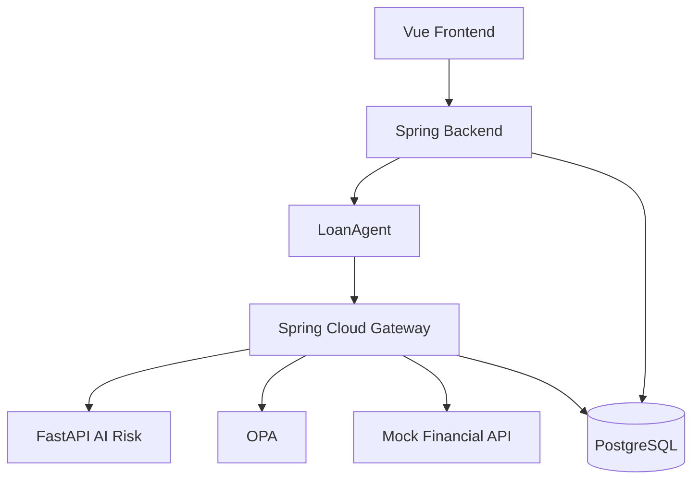
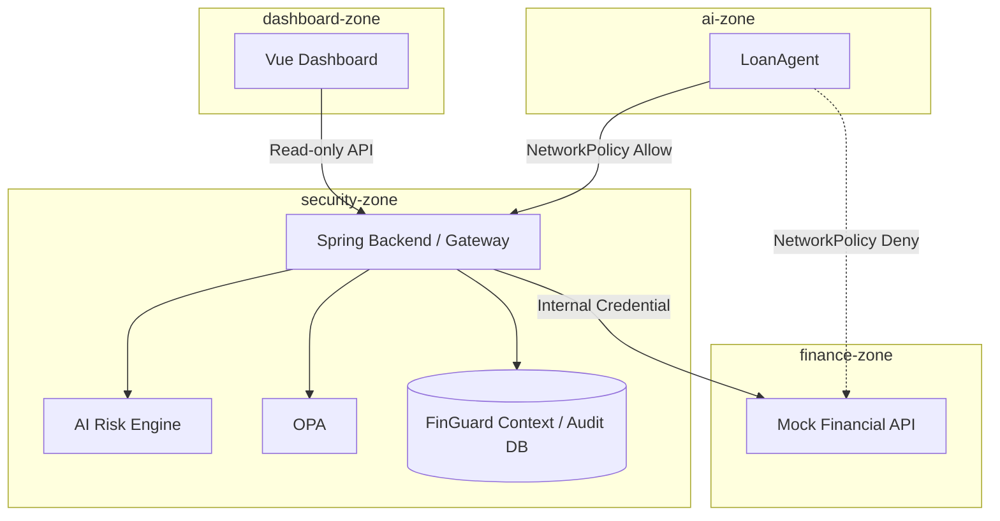

# FinGuard MVP Architecture

## 1. 설계 원칙

1. **Employee Authority는 Agent 권한의 상한선이다.**
2. **Permission Template은 업무별 표준 제약조건이며 Employee Authority를 대체하지 않는다.**
3. **Financial Case와 Consumer Mandate가 현재 고객·목적·Data 범위를 추가로 좁힌다.**
4. **Scope Status 계산과 PolicyDecision을 분리한다.**
5. **AI는 Risk를 분석하고 OPA가 정책을 판단하며 Gateway가 실제 행동을 통제한다.**
6. **Detection은 확률적일 수 있지만 Enforcement는 deterministic 해야 한다.**
7. **Agent가 보내는 Identity/권한 주장값을 신뢰하지 않는다.**
8. **BLOCK된 Tool Call은 실제 금융 API에 도달하지 않아야 한다.**
9. **P0 배포는 Docker Compose로 단순화하고 Kubernetes는 P1 Hardening으로 분리한다.**

핵심 원칙:

```text
Agent Effective Permission
⊆
Employee Authority
```

---

## 2. 권한 생성 흐름



권한 계산:

```text
Employee Authority
∩ Permission Template
∩ Financial Case
∩ Consumer Mandate
        ↓
Agent Effective Permission
        ↓
Task Passport
```

Task Passport는 현재 Case에 대한 Runtime Permission Snapshot이다.

---

## 3. P0 논리 아키텍처



### 주의

- Vue Dashboard는 PostgreSQL을 직접 조회하지 않는다.
- FastAPI Risk Engine은 최종 `ALLOW / BLOCK`을 반환하지 않는다.
- OPA는 Scope Status를 입력받으며 Case/Tool/Data 비교를 재수행하지 않는다.

---

## 4. Runtime 요청 흐름



---

## 5. Scope Status와 PolicyDecision 책임 경계

### Financial Context Resolver

질문:

> **현재 요청이 각 권한/Context 범위 안에 있는가?**

출력:

```text
employeeAuthority = OK / VIOLATION
permissionTemplate = OK / VIOLATION
caseStatus = OK / VIOLATION
mandate = OK / VIOLATION
passportStatus = OK / VIOLATION
agentBinding = OK / VIOLATION
customerScope = OK / VIOLATION
toolScope = OK / VIOLATION
dataScope = OK / VIOLATION
```

예:

```text
Case Consumer = CUST-1001
Request Consumer = CUST-9999

→ customerScope = VIOLATION
```

### OPA

질문:

> **현재 Scope 상태와 AI Risk를 정책에 적용했을 때 실제 행동을 허용할 것인가?**

입력:

```text
Scope Status
Prompt Risk
Behavior Risk
Hard Limit Status
```

출력:

```text
ALLOW / BLOCK
Severity
riskFlagged
Reason Codes
Policy Version
```

### Single Source of Truth

```text
Scope 비교
→ Spring Financial Context Resolver만 담당

최종 정책 조합
→ OPA만 담당
```

Rego에서 `case.consumerId != request.targetConsumerId` 같은 동일 비교를 다시 작성하지 않는다.

---

## 6. 서비스 책임

### 6.1 Vue Frontend

- AgentRun 실행 화면
- Employee Authority vs Agent Effective Permission 화면
- Security Dashboard
- Spring API만 호출
- DB 직접 접근 금지

### 6.2 Spring Backend — Financial Context

- Employee / Employee Authority
- Consumer / Mandate Seed
- Permission Template
- Financial Case
- Agent Effective Permission
- Task Passport
- Financial Context Resolver
- Dashboard Read API

### 6.3 Spring Cloud Gateway / Authorization

- Runtime Tool Call Interception
- Service Credential 검증
- Verified Agent Identity
- Request ID / Trace ID / Idempotency
- AuthorizationContext 생성
- FastAPI Risk Engine 호출
- OPA 호출
- ALLOW/BLOCK Enforcement
- Fail-closed

### 6.4 LoanAgent

- 대출심사 실행
- Gateway Tool endpoint만 호출
- Runtime Body에서 권한을 직접 주장하지 않음
- Mock Financial API 직접 호출 금지

### 6.5 FastAPI AI Risk Engine

- Prompt Injection Detection
- Behavior Risk Inference
- Risk Calibration Artifact 사용
- Prompt 원문 비저장·비로깅
- Model / Feature Version 반환

반환하지 않는 값:

```text
ALLOW
BLOCK
```

### 6.6 OPA

- Scope Status + AI Risk + Hard Limit을 Rego 정책으로 조합
- 최종 `ALLOW / BLOCK`
- Severity / riskFlagged / Reason Code / Policy Version 반환

### 6.7 Mock Financial API

- `CREDIT_SCORE_READ`
- `INCOME_READ`
- `DEBT_READ`
- 시연용 가상 데이터
- Gateway Internal Credential 검증
- 호출 횟수 테스트 지원

### 6.8 PostgreSQL

P0 저장 대상:

```text
Employee
EmployeeAuthority
Consumer
ConsumerMandate
PermissionTemplate
FinancialCase
TaskPassport
AgentRun
SecuredAgentInput Reference
AuditEvent
```

### 6.9 Audit / Dashboard

- `ALLOW / BLOCK / ERROR` 모두 기록
- Scope / AI / OPA 근거 기록
- 원문 Prompt / 금융 응답 미저장
- Vue는 Spring Read-only API로만 조회

---

## 7. 신뢰 경계

### 신뢰하지 않는 값

```text
Agent Body의 agentId
Agent Body의 employeeId
Agent가 주장한 allowedTools / allowedData
Agent가 주장한 Case 내용
Agent가 첨부한 내부 Identity Header
Tool Call에 다시 첨부된 Prompt
```

### 신뢰하는 값

```text
Gateway가 Service Credential로 검증한 Agent ID
PostgreSQL의 Employee Authority
PostgreSQL의 Permission Template
PostgreSQL의 Financial Case
PostgreSQL의 Consumer Mandate
PostgreSQL의 Task Passport
서버가 관리하는 AgentRun Input Reference
버전이 확인된 AI Risk Result
버전이 확인된 OPA PolicyDecision
```

---

## 8. Gateway 우회 방지 — P0

정상 경로:

```text
LoanAgent
→ FinGuard Gateway
→ Authorization
→ Mock Financial API
```

직접 경로:

```text
LoanAgent
X→ Mock Financial API
```

P0에서는 다음 두 가지를 적용한다.

1. LoanAgent 코드는 Mock Financial API Endpoint를 직접 사용하지 않는다.
2. Mock Financial API는 Gateway가 발급한 Internal Credential이 없으면 요청을 거부한다.

즉 Docker Compose 환경에서도 Gateway를 우회한 직접 호출 테스트가 실패해야 한다.

---

## 9. Audit 쓰기 순서

```text
1. 최소 Request Envelope / Size 검증
2. Request ID / Trace ID 발급
3. PROCESSING Audit insert
4. Agent Credential 검증
5. Verified Identity 보충
6. Context Resolver / AI Risk / OPA 수행
7. ALLOW이면 Downstream 실행
8. Execution Outcome으로 동일 AuditEvent 완성
```

저장 상태:

```text
PROCESSING
→ COMPLETED
or
→ ERROR
```

정책 `BLOCK`은 시스템 `ERROR`와 구분한다.

---

## 10. 장애 정책

| 장애 | P0 처리 |
|---|---|
| Employee/Case/Passport 필수 Context 없음 | BLOCK |
| Prompt Risk Engine Timeout | BLOCK |
| Behavior Risk Engine Timeout | BLOCK |
| OPA Timeout / Invalid Response | BLOCK |
| Audit 선저장 실패 | 금융 API 미호출 |
| Mock Financial API Timeout | ERROR Audit, responseReleased=false |
| 중복 Request ID | 금융 API 최대 1회 실행 |

MVP에서는 보안 우선 `fail-closed`를 사용한다. 실제 운영 고도화에서는 업무 위험도 기반 degraded mode를 별도 검토한다.

---

## 11. P0 배포 구조 — Docker Compose



P0 목표는 **모든 필수 컴포넌트를 Docker Compose로 재현 가능하게 실행하는 것**이다.

---

## 12. P1 Deployment Hardening — Kubernetes

Kubernetes는 P0 핵심 기능이 아니라 Gateway 우회 방지를 인프라 수준에서 강화하는 P1이다.



P1 항목:

- Namespace
- ServiceAccount
- `automountServiceAccountToken=false`
- Default Deny NetworkPolicy
- 필요한 Service 간 Allow Policy
- RBAC 최소권한
- Cluster DNS Egress 허용

---

## 13. 아키텍처 성공 기준

```text
직원 권한은 넓지만 Agent 권한은 현재 Case로 축소된다.

Scope Status와 PolicyDecision의 책임이 중복되지 않는다.

AI Risk Engine은 권한을 부여하지 않는다.

BLOCK 요청은 Mock Financial API에 도달하지 않는다.

Dashboard는 DB를 직접 읽지 않는다.

P0 전체가 Docker Compose로 실행된다.
```
