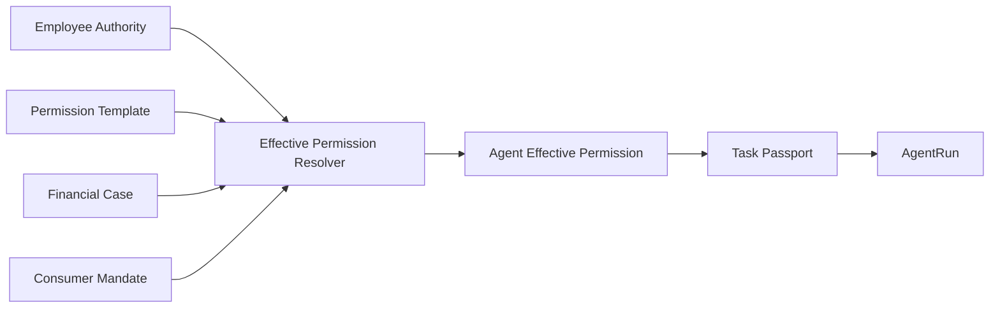
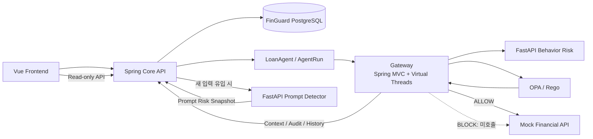
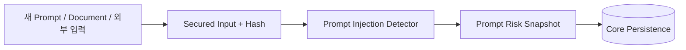
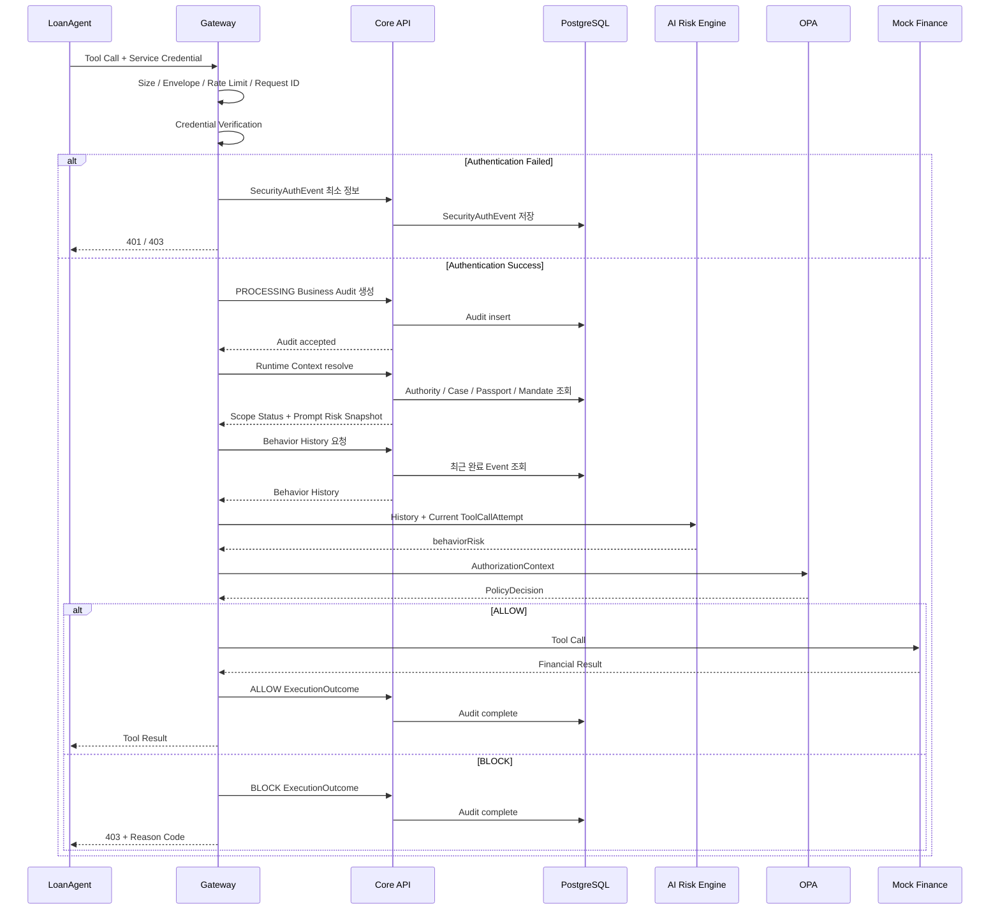
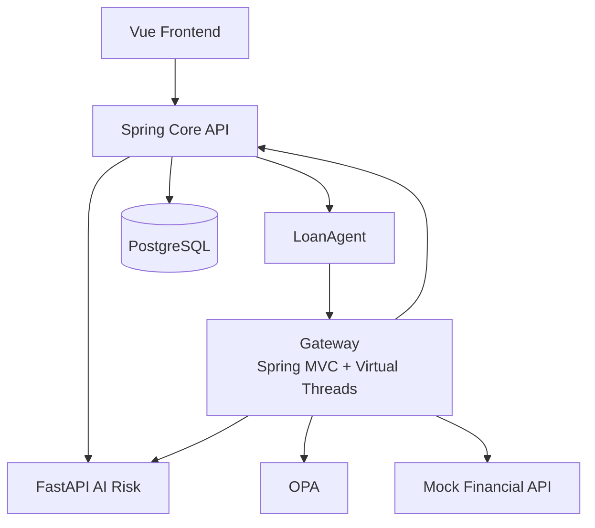

# FinGuard MVP Architecture — 2026.08.17 Freeze

## 1. 설계 원칙

1. **Employee Authority는 Agent 권한의 상한선이다.**
2. **Permission Template, Financial Case, Consumer Mandate는 권한을 좁힐 수만 있다.**
3. **Scope 계산은 Core Financial Context Resolver의 Single Source of Truth다.**
4. **OPA는 Scope Status를 정책으로 조합하고 동일 Scope 비교를 다시 구현하지 않는다.**
5. **AI는 Risk를 분석하고 OPA가 판단하며 Gateway가 집행한다.**
6. **Detection은 확률적일 수 있지만 Enforcement는 deterministic 해야 한다.**
7. **Gateway는 FinGuard PostgreSQL에 직접 접근하지 않는다.**
8. **Business Audit은 Agent 인증 성공 이후 시작한다. 인증 실패는 별도 SecurityAuthEvent로 남긴다.**
9. **Prompt Injection은 새로운 비신뢰 입력 유입 시 검사하고 동일 입력에 대해 Tool Call마다 반복하지 않는다.**
10. **P0는 Docker Compose, Kubernetes 우회 방지는 P1 Hardening이다.**

```text
Agent Effective Permission
⊆
Employee Authority
```

---

## 2. 권한 생성 흐름



```text
Employee Authority
∩ Permission Template
∩ Financial Case
∩ Consumer Mandate
        ↓
Agent Effective Permission
        ↓
Task Passport
```

Task Passport는 현재 Case의 Runtime Permission Snapshot이다.

---

## 3. P0 논리 아키텍처



### 핵심 DB 경계

```text
Core     → PostgreSQL O
Gateway  → PostgreSQL X
LoanAgent→ PostgreSQL X
Frontend → PostgreSQL X
FastAPI  → PostgreSQL X
OPA      → PostgreSQL X
```

Gateway는 다음이 필요할 때 Core Internal API를 호출한다.

```text
Financial Context / Scope Status
Business Audit 생성·갱신
SecurityAuthEvent 저장
Behavior History 조회
Prompt Risk Snapshot 조회
```

Runtime에서 Gateway는 Core 응답의 저장된 Prompt Risk Snapshot과 AI Risk Engine이 현재 Tool Call에
대해 계산한 Behavior Risk를 조립한다. Prompt Detector를 Tool Call마다 다시 호출하거나 Behavior
Client가 Prompt Risk를 새로 만들어서는 안 된다.

---

## 4. Prompt Risk Lifecycle



동일 입력의 Runtime Tool Call:

```text
inputHash 동일
modelVersion 동일
→ Prompt Detector 재호출 X
→ Prompt Risk Snapshot 재사용
```

새 문서나 Prompt가 추가되면 새 Input Hash로 다시 검사한다.

---

## 5. Runtime Tool Call 흐름



---

## 6. Scope Status와 PolicyDecision 책임

### Core Financial Context Resolver

질문:

> 현재 요청이 각 권한/Context 범위 안에 있는가?

```text
employeeAuthority = OK / VIOLATION
permissionTemplate = OK / VIOLATION
caseStatus = OK / VIOLATION
mandate = OK / VIOLATION
passportStatus = OK / VIOLATION
agentBinding = OK / VIOLATION
customerScope = OK / VIOLATION
toolScope = OK / VIOLATION
dataScope = OK / VIOLATION
```

### OPA

질문:

> 이 Scope 상태와 AI Risk, Hard Limit을 정책에 적용했을 때 실행할 것인가?

```text
Scope Status
+ Prompt Risk Snapshot
+ Behavior Risk
+ Hard Limit
        ↓
ALLOW / BLOCK
Severity
riskFlagged
Reason Codes
Policy Version
```

Rego에서 raw Customer/Tool/Data 비교를 중복하지 않는다.

---

## 7. 서비스 책임

### 7.1 Spring Core API — Backend 1

- Employee / Employee Authority
- Consumer / Consumer Mandate
- Permission Template
- Financial Case
- Agent Effective Permission
- Task Passport
- Financial Context Resolver
- Prompt Risk Snapshot Persistence
- Business Audit / SecurityAuthEvent Persistence
- Behavior History Read API
- Dashboard Read API
- **FinGuard PostgreSQL의 유일한 애플리케이션 접근 주체**

### 7.2 Gateway (Spring MVC + Virtual Threads) — Backend 2

- Runtime Tool Call Interception
- Request Size / Envelope / Rate Limit
- Service Credential 검증
- Verified Agent Identity
- Request ID / Trace ID / Idempotency
- Core Context/Audit/History API Client
- AI Risk Client
- AuthorizationContext 생성
- OPA Client
- ALLOW/BLOCK Enforcement
- Fail-closed
- **DB 직접 접근 금지**

### 7.3 LoanAgent / Mock Finance / Audit Contract — Backend 3

- AgentRun / LoanAgent / Simulator
- Tool Call 생성
- Mock Financial API / Mock 데이터
- ToolCallAttempt Contract
- ExecutionOutcome Contract
- AuditEvent Contract 설계 지원
- 정상/공격 Scenario

### 7.4 FastAPI AI Risk Engine — Frontend & AI

- Prompt Injection Detection: 새 입력 유입 시
- Behavior Risk: Tool Call마다
- Feature Builder
- Isolation Forest
- Model / Feature Version 반환
- ALLOW/BLOCK 직접 결정하지 않음
- DB 직접 접근하지 않음

### 7.5 OPA

- 이미 계산된 Scope Status + Risk + Hard Limit 평가
- `ALLOW / BLOCK`
- Severity / riskFlagged / Reason Code / Policy Version 반환

### 7.6 Vue Frontend

- AI 업무 지원 / LoanAgent 실행 / Financial Case
  - Authority vs Effective Permission 비교를 현재 업무 보호 패널에 통합
- Security Dashboard
- Core/Gateway API만 호출
- DB 직접 접근 금지

---

## 8. Audit 경계

### 인증 성공

```text
Gateway
→ Core Audit API
→ PROCESSING Business AuditEvent
→ Authorization
→ Outcome Update
```

Business Audit 선저장이 실패하면 Downstream은 호출하지 않는다.

### 인증 실패

```text
Gateway
→ Core Security Event API
→ SecurityAuthEvent
→ 요청 종료
```

SecurityAuthEvent에는 Prompt, Document, Tool Argument 전체, 금융 데이터 원문을 저장하지 않는다.

### DoS 완화 순서

```text
Request Size Limit
→ Rate Limit
→ Authentication
→ 최소 Security Event 기록
```

---

## 9. 장애 정책

| 장애 | P0 처리 |
|---|---|
| Core Context 조회 실패 | BLOCK |
| Business Audit 선저장 실패 | Downstream 미호출 |
| Prompt Risk Snapshot 필요하나 조회/분석 불가 | BLOCK |
| Behavior Risk Engine Timeout | BLOCK |
| Behavior History 조회 실패 | BLOCK |
| OPA Timeout / Invalid Response | BLOCK |
| Mock Financial API Timeout | ERROR Audit |
| 중복 Request ID | Downstream 최대 1회 실행 |

P0는 보안 우선 `fail-closed`를 사용한다.

---

## 10. P0 배포 구조 — Docker Compose



**`GW --> DB` 경로는 존재하지 않는다.**

P0 목표는 모든 필수 컴포넌트를 Docker Compose로 재현 가능하게 실행하는 것이다.

---

## 11. P1 Deployment Hardening — Kubernetes

Kubernetes는 P0 핵심 기능이 아니라 **Gateway 우회 방지를 네트워크/Workload 수준에서 강화하는 P1**이다.

권장 정책:

```text
LoanAgent → Gateway      ALLOW
LoanAgent → Mock Finance DENY
LoanAgent → PostgreSQL   DENY
Gateway   → PostgreSQL   DENY
Core      → PostgreSQL   ALLOW
Gateway   → Core         ALLOW
Gateway   → OPA          ALLOW
Gateway   → AI Risk      ALLOW
Gateway   → Mock Finance ALLOW
```

P1 항목:

- Namespace
- ServiceAccount
- `automountServiceAccountToken=false`
- Default Deny NetworkPolicy
- 필요한 Service 간 Allow Policy
- RBAC 최소권한
- Cluster DNS Egress

Kubernetes 미완성은 P0 실패로 간주하지 않는다.

---

## 12. 아키텍처 성공 기준

```text
직원 권한은 넓지만 Agent 권한은 현재 Case로 축소된다.
Scope 계산과 OPA Policy 판단이 중복되지 않는다.
Gateway는 FinGuard DB를 직접 읽거나 쓰지 않는다.
인증 실패는 Business Audit과 분리된 SecurityAuthEvent로 추적된다.
동일 Prompt/Document는 Tool Call마다 재추론하지 않는다.
Behavior Risk는 Tool Call마다 최신 이력으로 계산한다.
BLOCK 요청은 정상 Runtime 경로에서 Mock Finance에 도달하지 않는다.
P0 전체가 Docker Compose로 실행된다.
Kubernetes 우회 방지는 P1로 분리된다.
```
